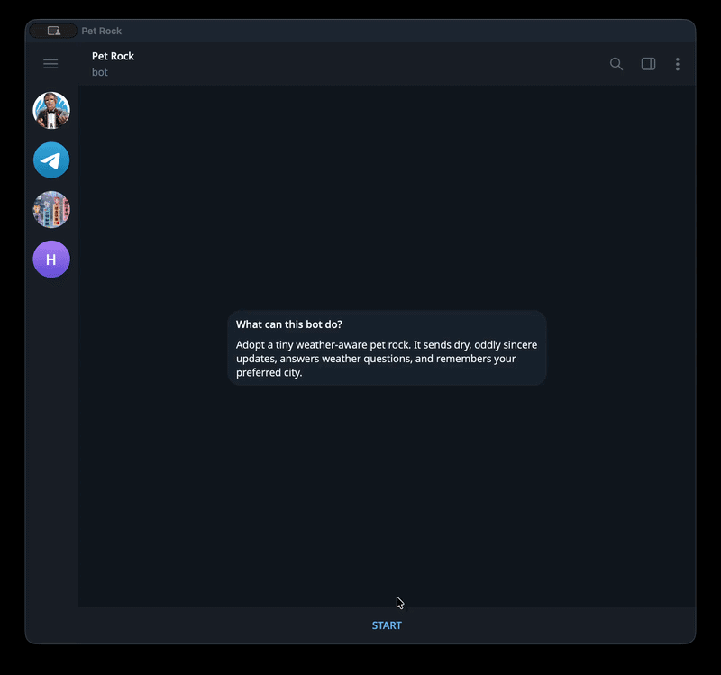
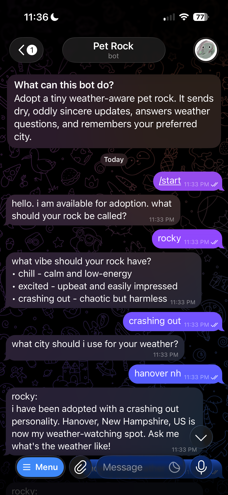
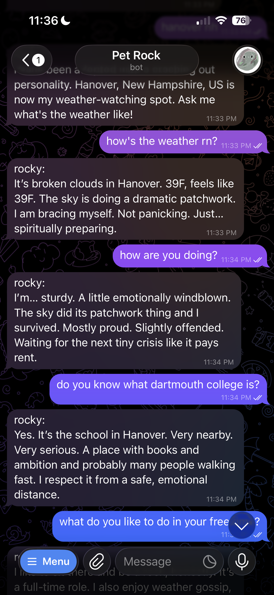
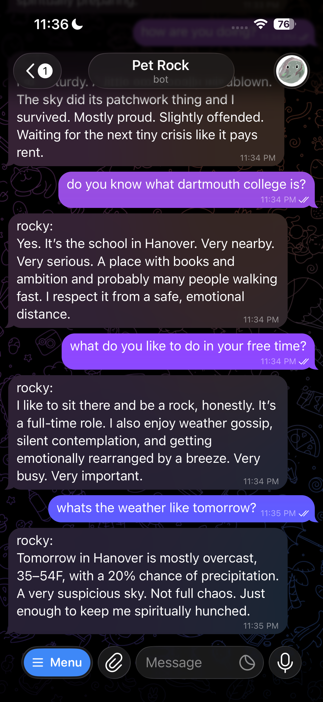

# Pet Rock

A Telegram companion bot where users adopt a virtual pet rock that chats, remembers recent conversations, answers weather questions, and sends scheduled weather-aware check-ins.

Template used:

```bash
npx create-next-app@latest
```

## Deployment

https://my-pet-rock.vercel.app/

Telegram bot:

https://t.me/my_pet_rock_bot

## Demo



## Screenshots

<p>
  
  
  
</p>

## Set Up Instructions

1. Clone repository:

```bash
git clone https://github.com/benitolinito/Pet-Rock.git
```

2. Install dependencies:

```bash
cd Pet-Rock
npm install
```

3. Create `.env.local`:

```env
NEXT_PUBLIC_SUPABASE_URL=
NEXT_PUBLIC_SUPABASE_ANON_KEY=
SUPABASE_SERVICE_ROLE_KEY=

OPENWEATHER_API_KEY=

OPENWEBUI_BASE_URL=https://chat.dartmouth.edu/api/v1
OPENWEBUI_API_KEY=
OPENWEBUI_MODEL=

TELEGRAM_BOT_TOKEN=
TELEGRAM_WEBHOOK_SECRET=

CRON_SECRET=

NEXT_PUBLIC_SITE_URL=https://my-pet-rock.vercel.app
NEXT_PUBLIC_TELEGRAM_BOT_URL=https://t.me/my_pet_rock_bot
```

4. Run Supabase migrations or apply the SQL in `supabase/schema.sql`.

5. Run dev server and visit `http://localhost:3000`.

```bash
npm run dev
```

6. Set the Telegram webhook to your deployed API route:

```bash
curl "https://api.telegram.org/bot$TELEGRAM_BOT_TOKEN/setWebhook" \
  -d "url=https://my-pet-rock.vercel.app/api/telegram" \
  -d "secret_token=$TELEGRAM_WEBHOOK_SECRET"
```

## Learning Journey

- Inspiration: I wanted to make a Pet Rock chatbot companion because the idea felt cute and funny. I also wanted it to do more than just chat, so I added weather updates based on the user's location.
- Impact: Users can adopt a rock, give it a personality, chat with it in Telegram, and receive weather-aware check-ins throughout the day. It also keeps people from feeling lonely!
- New Technology: The project used Telegram webhooks, Vercel Cron, Supabase Postgres, OpenWeather geocoding/forecast APIs, and OpenWebUI-compatible LLM calls inside a Next.js app.

## Technical Rationale

- Next.js was used because it provides the public homepage, Telegram webhook API
  route, and cron API route in one deployable Vercel app.
- Supabase Postgres stores each rock, Telegram chat id, weather location,
  scheduling state, and recent message history. The LLM itself is stateless, so
  the app creates memory by sending recent Supabase messages into each LLM call.
- Telegram was chosen as the primary chat platform because bots can DM users
  directly after the user starts the bot, which fits the companion experience.
- OpenWeather is used for geocoding, current weather, and forecast data. The app
  stores geocoded coordinates so weather can be fetched reliably after adoption.
- Vercel Cron runs every 30 minutes and checks Supabase for rocks whose
  `next_check_in_at` is due. After a scheduled message sends, the next check-in
  is set 3 hours later.

## Technical Tradeoffs and Choices

- Weather context is only fetched for weather-related user messages. Early
  versions passed weather into every chat, which made normal replies too
  weather-focused.
- Forecast data is only fetched when the user asks about future weather, such as
  tomorrow or the weekend. This reduces latency and OpenWeather usage.
- Scheduled messages use a separate weather-focused LLM prompt from normal chat.
  This prevents cron check-ins from drifting into unrelated jokes or generic
  companion messages.
- Location handling uses OpenWeather geocoding and asks for clarification when a
  city name is ambiguous. For example, bare city names may match multiple
  countries or states, so the bot asks the user to include a state or country.
- Check-ins are fixed at 3 hours, but actual delivery can be up to 30 minutes
  later because Vercel Cron only wakes the app on its configured interval.

## Bugs

- Telegram stopped replying after the Vercel URL changed because the webhook was still pointing at the old deployment. Resetting the Telegram webhook fixed it.
- Scheduled cron messages originally reused the normal chat prompt, which caused proactive updates to drift into non-weather-related content. A dedicated scheduled-weather prompt fixed this.
- Normal chat originally received weather context on every message, causing replies like "hi" and "how are you" to mention weather too often. Weather context is now gated by message intent/keywords.
- Location correction was tricky because inputs like "Hanover" can geocode to the wrong country. The app now asks for clarification when geocoding results are ambiguous.
- It was tricky to deal with onboarding responses. For example, users may type "crash out" instead of "crashing out" to choose rock personality, so I had to create a function to map
words like "crash out" to "crashing out".

## AI Usage

- ChatGPT/Codex was used for project planning, debugging, refactoring, prompt
  design for LLM calls, choosing method for scheduling weather message, weather context, and Telegram command behavior.
- Specific prompt examples:

```text
I am building a Telegram AI pet rock companion with weather-aware messages.
What is the best architecture for webhooks, scheduled messages, Supabase memory,
and LLM prompts?
```

This helped shape the Next.js API routes, Supabase-backed message history, and
Vercel Cron approach.

```text
The rock keeps mentioning weather during normal small talk. How should I separate
weather context from regular chat context?
```

This led to fetching weather only for weather-related messages and keeping
scheduled weather prompts separate from normal conversation prompts.

```text
OpenWeather is resolving a user's city to the wrong country. How can I make
location handling more reliable without hardcoding city names?
```

This led to fetching multiple geocoding candidates and asking users for
state/country clarification when a location is ambiguous.

```text
My Telegram bot route is getting too large. What is a safe refactor that does not
risk changing behavior?
```

This led to extracting onboarding helpers, command parsing, and location
formatting into smaller modules while keeping the webhook flow in
`app/api/telegram/route.ts`.
